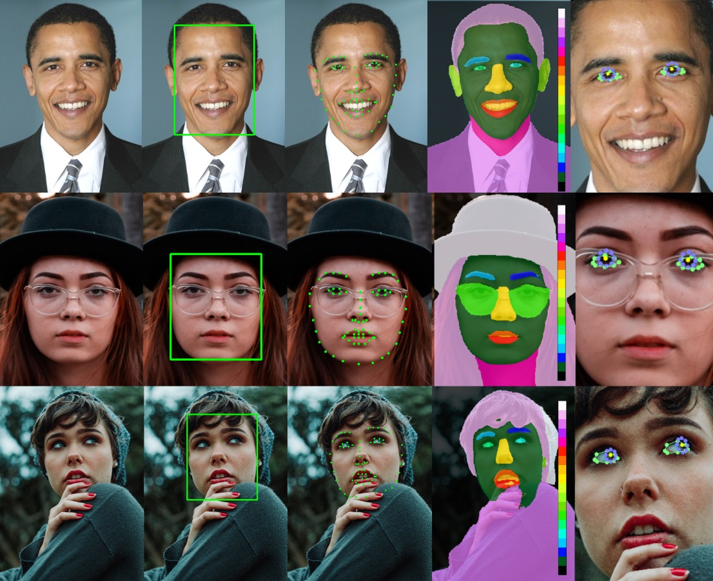

# face-toolbox-keras

A collection of deep learning frameworks ported to Keras for face detection, face segmentation, face parsing, iris detection.



## Descriptions

This repository contains deep learning frameworks that we collected and ported to Keras. We wrapped those models into separate modules that aim to provide their functionality to users within 3 lines of code.

- **Face detection:**
  - S3FD model ported from [1adrianb/face-alignment](https://github.com/1adrianb/face-alignment).
  - MTCNN model ported from [davidsandberg/facenet](https://github.com/davidsandberg/facenet).
- **Face landmarks detection:**
  - 2DFAN-4, 2DFAN-2, and 2DFAN-1 models ported from [1adrianb/face-alignment](https://github.com/1adrianb/face-alignment).
- **Face parsing:**
  - BiSeNet model ported from [zllrunning/face-parsing.PyTorch](https://github.com/zllrunning/face-parsing.PyTorch).

##### *Each module follows the license of their source repo. Notice that some models were trained on dataset with non-commercial license.

## Usage

[](https://colab.research.google.com/github/shaoanlu/face-toolbox-keras/blob/master/demo.ipynb) (Please run `pip install keras==2.2.4` before initializaing models.)

This colab demo requires a GPU instance. It demonstrates all face analysis functionalities above.

### 1. Face detection
```python
models.detector.face_detector.FaceAlignmentDetector(fd_weights_path=..., lmd_weights_path=..., fd_type="s3fd")
```

**Arguments**
- `fd_weights_path`: A string. Path to weights file of the face detector model.
- `lmd_weights_path`: A string. Path to weights file of the landmarks detector model.
- `fd_type`: A string. Face detector backbone model of either `s3fd` or `mtcnn`.

**Example**
```python
from models.detector import face_detector

im = cv2.imread(PATH_TO_IMAGE)[..., ::-1]
fd = face_detector.FaceAlignmentDetector()
bboxes = fd.detect_face(im, with_landmarks=False)
```

### 2. Face landmarks detection

The default model is 2DFAN-4. Lite models of 2DFAN-1 and 2DFAN-2 are also provided.

| GPU | 2DFAN-1 | 2DFAN-2 | 2DFAN-4 |
|:---:|:-------:|:-------:|:-------:|
| K80 | 74.3ms  | 92.2ms  | 133ms   |

**Example**
```python
from models.detector import face_detector

im = cv2.imread(PATH_TO_IMAGE)[..., ::-1]
fd = face_detector.FaceAlignmentDetector()
bboxes, landmarks = fd.detect_face(im, with_landmarks=True)
```

### 3. Face parsing
```python
models.parser.face_parser.FaceParser(path_bisenet_weights=...)
```

**Arguments**
- `path_bisenet_weights`: A string. Path to weights file of the model.

**Example**
```python
from models.parser import face_parser

im = cv2.imread(PATH_TO_IMAGE)[..., ::-1]
fp = face_parser.FaceParser()
# fp.set_detector(fd) # fd = face_detector.FaceAlignmentDetector()
parsing_map = fp.parse_face(im, bounding_box=None, with_detection=False)
```

### 4. Eye region landmarks detection
```python
models.detector.iris_detector.IrisDetector()
```

Faster face detection using MTCNN can be found in [this](https://github.com/shaoanlu/GazeML-keras) repo.

**Example**
```python
from models.detector import iris_detector

im = cv2.imread(PATH_TO_IMAGE)[..., ::-1]
idet = iris_detector.IrisDetector()
idet.set_detector(fd) # fd = face_detector.FaceAlignmentDetector()
eye_landmarks = idet.detect_iris(im)
```


## Known issues
It works fine on Colab at this point (2019/06/11) but for certain Keras/TensorFlow version, it throws errors loading `2DFAN-1_keras.h5` or `2DFAN-2_keras.h5`.

## Requirements
- Keras 2.2.4
- TensorFlow 1.12.0 or 1.13.1

## Acknowledgments
We learnt a lot from [1adrianb/face-alignment](https://github.com/1adrianb/face-alignment), [zllrunning/face-parsing.PyTorch](https://github.com/zllrunning/face-parsing.PyTorch), [swook/GazeML](https://github.com/swook/GazeML), [deepinsight/insightface](https://github.com/deepinsight/insightface), [davidsandberg/facenet](https://github.com/davidsandberg/facenet), and [ZhaoJ9014/face.evoLVe.PyTorch](https://github.com/ZhaoJ9014/face.evoLVe.PyTorch).
